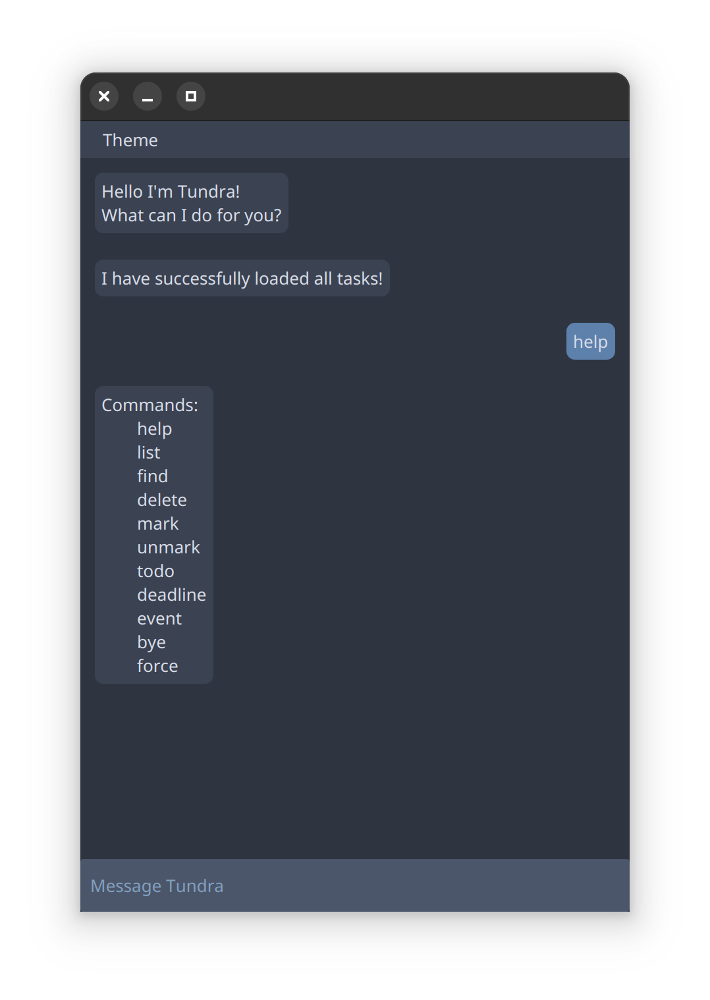

# Tundra User Guide



Tundra is a graphical task management application.

## Getting started

Ensure you have installed Java 17 or later. Download the latest version of Tundra 
[here](https://github.com/zuoshihua/ip/releases/latest/download/tundra.jar).

Open the Terminal (MacOS/Linux) or Command Prompt (Windows) and enter

```
java -jar tundra.jar
```

List all tasks with the `list` command.

View help with the `help` command.

## Add deadlines

Deadlines are tasks with a due date and time.

- Usage: `deadline [description] /by [date/time]`
- Example: `deadline return book /by 2025-02-20 1800`

## Add events

Events are tasks with start and end dates and times.

- Usage: `event [description] /from [date/time] /to [date/time]`
- Example: `event project meeting /from 2025-02-20 1800 /to 2025-02-20 1900`

## Add todos

Todos are tasks with no dates or times.

- Usage: `todo [description]`
- Example: `todo read book`

## Mark tasks

Indicate task as completed.

- Usage: `mark [number]`
- Example: `mark 1`

## Unmark tasks

Indicate task as NOT completed.

- Usage: `unmark [number]`
- Example: `unmark 1`

## Delete tasks

Remove a task.

- Usage: `delete [number]`
- Example: `delete 1`

## Duplicate task

By default, Tundra does not allow tasks to be duplicated. 
Override this behavior with the `force` command.

- Usage: `force [command]`
- Example: `force deadline return book /by 2025-02-20 1800`